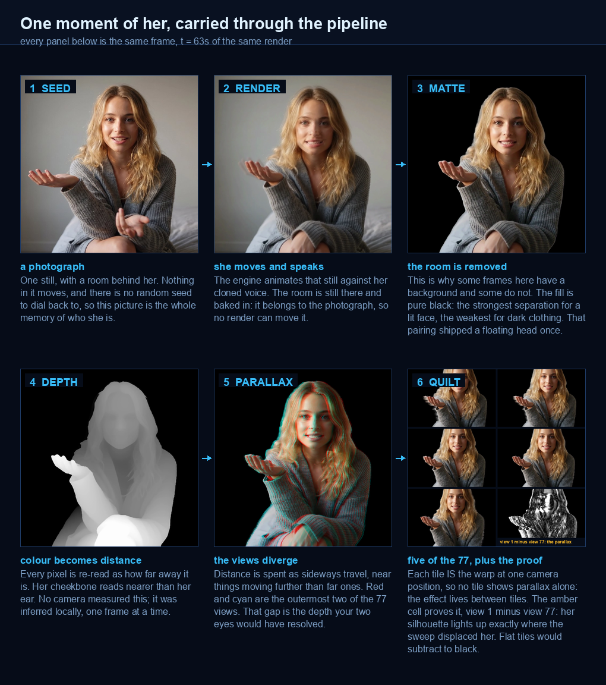
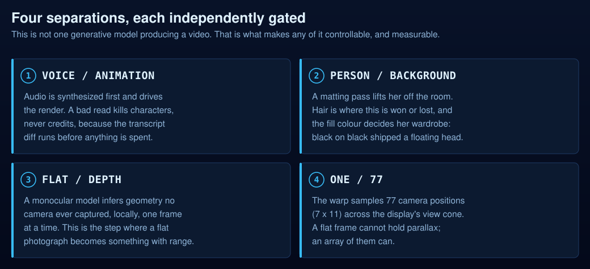
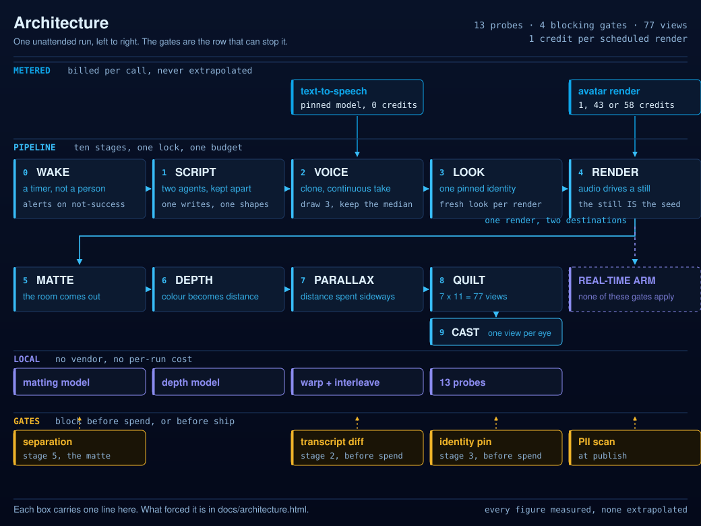
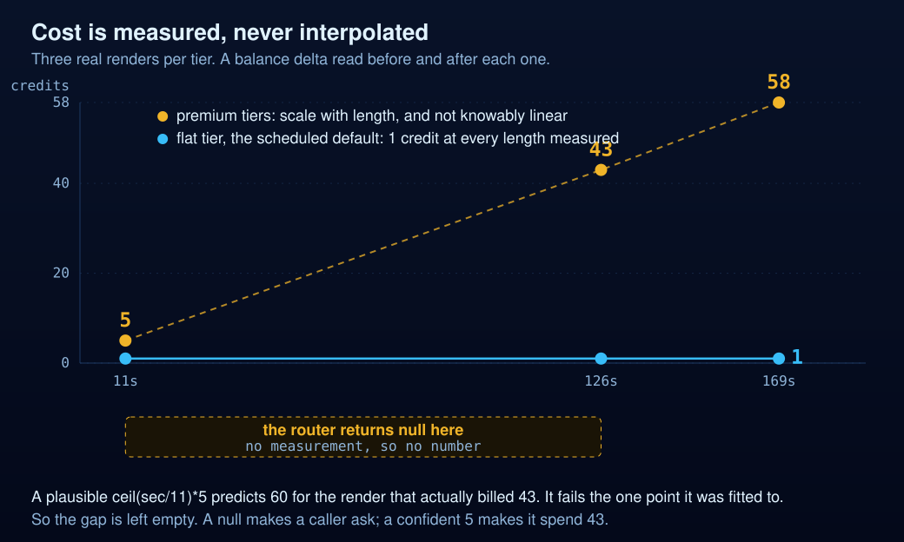

<p align="center">
  
</p>

<p align="center">
  
  
  
  
  
  
</p>

**An advertising-grade AI filmmaking pipeline where the evals are the product.**

| Who it is for | The difference |
|:---|:---|
| An ad team that cannot watch every render, because it runs on a schedule against metered APIs. [What changes for them](#an-ad-team-before-and-after) | The render path is not the hard part. Ten scoring models were built and killed in one day for disagreeing with the labels. [The five hard problems](#the-five-hard-problems-in-talking-head-video) |
| **The flow** | **The benchmark** |
| `label` then `derive` then `gate` then `render` then `relabel`. Nothing renders that the gates have not cleared | 16 of 16 named thresholds bracketed by labelled exemplars. [10 of 10 scheduled days, 0 missed](#what-holds-when-nobody-is-watching) |

It writes a script and speaks it in a cloned voice. It renders a consistent generated avatar, separates her from her background, infers depth, and emits 77 views of a single instant for a light-field display. It does this on a schedule, against metered vendor APIs, with nobody watching.

**What makes that survivable is not the render path.** Editorial judgement is captured as labels, compiled into thresholds, and wired into gates that can refuse to spend.

<table>
  <tr>
    <td width="34%" align="center" valign="top">
      <br>
      <sub><b>Depth, on a flat screen.</b> A virtual camera sways across the inferred depth map, near pixels travelling further than far ones. <b>This clip is exaggerated 4x and says so on the frame.</b> The real sweep across all 77 views moves her <b>19 px</b> inside a 480 px tile, about 4 percent, which is honest and nearly invisible at this size. The amber tick is fixed, because without something stationary the eye tracks her and cancels the very displacement the clip exists to show.</sub>
    </td>
    <td width="33%" align="center" valign="top">
      <br>
      <br>
      <sub><b>Six of the 77 views, one instant.</b> Spread across the whole sweep rather than neighbours, because adjacent views differ by <b>0.25 px</b> and a block of them reads as one photo repeated. These are warped at the full square framing rather than cropped out of the quilt, so they sit at the same scale as the clips beside them; the panel's own tiles trim top and bottom to a 1.57 aspect. Every frame of the clip carries its own 77. <b><a href="assets/quilt-video.mp4">&#9654; full quilt video</a></b></sub>
    </td>
    <td width="33%" align="center" valign="top">
      <br><br>
      <br>
      <sub><b>And she explains her own pipeline, in the final treatment.</b> The full narration under the simulated view sweep the first cell demonstrates, one pass, start to finish. This loop is her describing the very grid the middle cell shows: one moment, seventy-seven positions. GIFs are mute and the voice is half the point: <b><a href="assets/hologram-full.mp4">&#9654; watch with sound (2:49)</a></b></sub>
    </td>
  </tr>
</table>

> The avatar is generated. She is not a real person and not a likeness of one. Her voice is a clone of a consented source. Every asset on this page comes from **one** run of the pipeline, deliberately, because a montage of lucky takes would hide the thing this repo is about.

---

## Start here

| If you want to | Go to |
|---|---|
| See whether it works | The three clips above, all from [one run](#what-actually-happens-to-her) |
| Run something yourself | [What ships here](#what-ships-here-and-what-does-not), then [Running it](#running-it) |
| Read the argument | [Evals lead this](#evals-lead-this) |
| Build your own | [`docs/SETUP.md`](docs/SETUP.md), consent line first |
| See what is not claimed | [`docs/NOT-MEASURED.md`](docs/NOT-MEASURED.md) |

## The five hard problems in talking-head video

These are the field's named problems, not this repo's. The right column says where this stack actually stands on each.

| | The challenge | Where this stack stands |
|---|---|---|
| 1 | **Audiovisual synchrony.** Does the mouth match the sound? Scored as LSE-C and LSE-D through SyncNet. ITU-R BT.1359 puts human detection at roughly 45 ms of audio lead and 125 ms of lag, so the target is under two frames. | **Open.** A metric here agreed with the eye 8 times out of 8 and shipped as a blocker. It then swung 6 to 10 frames against itself inside a single clip and was demoted the same hour. |
| 2 | **Identity drift.** Is it the same person thirty seconds later, and in tomorrow's take? Measured as ArcFace cosine similarity against a reference face. | **Constrained, not measured.** 174 identity records and 279 approved looks pinned to one allowlist. Pinning avoids the drift rather than detecting it. |
| 3 | **Alpha matting.** Cutting the room away cleanly. The named failures are hair matting, spill, edge fringing, haloing, and dark clothing against a dark background. | **Traded off knowingly.** Pure black is the strongest separation for a lit face and the weakest for dark clothing. Those are one decision, and this repo shipped a floating head before noticing. |
| 4 | **Gesture-speech synchrony.** Beat gestures land on pitch accents. Timing is asymmetric: a late gesture is caught, an early one is forgiven. | **Diagnosed, not gated.** Thirteen metrics found nothing until a human said the movement lags the speech. Late is caught at about 200 ms. Nothing gates it today. |
| 5 | **Cross-view consistency.** Every one of the 77 views has to agree, and monocular depth has to fill what the new angle uncovers. Angular consistency and ray-level disocclusion. | **The light-field-only problem.** Adjacent views differ by 0.25 px and the full sweep moves her 19 px inside a 480 px tile. A flat video never has to answer this. |

**What this pipeline sidesteps rather than solves.** Other problems in this space are not load-bearing here: profile and side views, hands and fingers, multi-person scenes, emotion control, cross-language audio. This renders one frontal avatar, alone, in one language. That is scope, not a solution, and it is the reason the five above are the ones worth measuring.

Three of the five are open or ungated, and the honest reading is that the render path is not what makes this hard. The long-form version, with every retraction, is [what I found by measuring it](#what-i-found-by-measuring-it).

## An ad team, before and after

Left is how the work goes today. Right is what changes. Every claim on the right is backed by a measured figure in [the numbers](#the-numbers).

| Before | After |
|---|---|
| Someone watches every take and decides. | Nobody watches. Bad takes never reach you. |
| You find out it was bad after you paid for it. | It gets stopped before the money goes. |
| "Looks right" lives in one editor's head, and leaves when they do. | "Looks right" is written down, and it stays. |
| A check gets trusted because it agreed with you once. | A check has to survive being wrong before it can block anything. |
| You hope she still looks like herself across the campaign. | Same face, same silhouette, every spot. The wardrobe changes; she does not. |
| You learn what a long clip costs when the invoice arrives. | You know the price before you commit. |
| Someone has to be awake for it. | It runs overnight, and tells you if it did not. |

**No row above claims a time saving, and that is deliberate.** Claiming one needs a defined manual procedure, at least five timed human runs, and the same quality bar applied to both. None of those exist here, so the comparison is about how the work is governed rather than how long it takes. The full accounting of what is not claimed, and what it would take to claim it, is [`docs/NOT-MEASURED.md`](docs/NOT-MEASURED.md).

## What holds when nobody is watching

The operator is asleep and the schedule fires anyway. That is the normal state, and it is the state the gates exist for.

| Runs unattended | Cadence | What it catches |
|---|---|---|
| The scheduled run | Daily | 10 of 10 consecutive days, 0 missed |
| The transcript check | Before every spend | A script that did not survive synthesis, 541 of 541 words on this clip |
| The four gates | Every render | A take that violates a derived threshold |
| `derive.py` in CI | Every push | A threshold moved outside the interval its own labels imply |
| The cost router | Every estimate | Interpolation between measured points, after one confident estimate understated a batch by 8.6x and burned 344 credits |

**Three of the four gates fail open, and the page says so rather than hiding it.** That is a declared rank, not an oversight: it was found by deliberately deleting a config and watching which guards still showed green. A guard that silently approves is the exact failure this repository went looking for and found in its own code.

---

## What actually happens to her

Every image below is the **same frame**, `t = 63s`, of the same render. That constraint is the point: if two panels disagree, it is the stage that changed her, not a different take, a different day or a luckier moment.

<p align="center">
  
</p>

<table>
  <tr>
    <td width="34%" align="center">
      <br>
      <sub><b>The same six stages, cut.</b> A grid invites you to compare compositions. A cut on a locked frame shows only what the stage changed.</sub>
    </td>
    <td>
      <b>Why some frames on this page have a background and some do not.</b> Stages 1 and 2 still carry the room, because the room is part of the photograph and no render can move it. Stage 3 takes it out and replaces it with pure black, which is the strongest available separation for a lit face and the weakest for dark clothing. Those two facts are one decision, and this repository shipped a floating head before noticing that.<br><br>
      <b>Stage 4 is where she stops being a picture of a person and becomes a measurement.</b> Depth is inferred locally, per frame, from a flat image no camera ever ranged. Stage 5 spends that depth sideways, moving near pixels further than far ones, which is the only step that produces something two eyes can disagree about. Stage 6 packs all 77 of those disagreements into one frame.<br><br>
      The chain ends there on purpose. What the panel does with that frame is hand a different view to each of your eyes, and no screenshot can reproduce that honestly, so the pictures stop rather than pretend.
    </td>
  </tr>
</table>

---

## Evals lead this

Problems one and two are why the pipeline is shaped the way it is. A plausible failure is only catchable by an eye, that eye cannot be awake at render time, and the failure is different in tomorrow's draw anyway.

So the pipeline's real job is to make a human eye present at render time by having captured it earlier:

```
label  ->  derive  ->  gate  ->  render  ->  relabel
```

**Label.** 113 hand-labelled stills. 67 labelled clips. 174 frame-level identity records. 677 pairwise A/B verdicts. A render ledger of 14 renders, 7 kept and 3 rejected. Plain-language verdicts, kept as data.

**Derive.** Sixteen of the sixteen named gating thresholds in [`probes/`](probes/) come from a labelled pass exemplar and a labelled fail exemplar, and [`evals/derive.py`](evals/derive.py) holds every one inside the interval its labels imply. Move a threshold out of its bracket and CI goes red. The eye model's background bar (4.5) is one of them: it sits between the worst labelled pass (3.30) and the best labelled reject (5.32). Named is the load-bearing word, and the tool says so itself: `lipsync_probe` still refuses clips on nine inline numbers, and a number without a name cannot be bracketed.

**Gate.** Thresholds become guards that run before money is spent. Judging is blind. Gates are ranked by what happens when they are violated, which is why the same constraint held 14 of 15 runs at the outcome and only 6 of 15 at the first attempt: the gap is a pre-call hook, not better prose.

**Relabel.** Ten scoring models were built in one day and every one inverted against the labels. A lip-sync metric agreed with the eye 8 times out of 8, was wired in as a blocker within minutes, then measured 6 to 10 frames of swing against itself inside a single clip and was demoted the same hour. A brightness bar set to 8.0 because one engine's clip measured 7.9 turned out to mean *resemble that engine*, and steered choices for six hours while gating nothing. Thirteen metrics found nothing about gesture timing until the human said the movement lags the speech, and the literature explained why: gesture aligns to pitch accents as discrete events, so a late one is caught at about 200 milliseconds while an early one is forgiven.

**Full doctrine, with every number and every retraction: [`docs/EVALS.md`](docs/EVALS.md).**

## The render behind those clips, scored by this repo's own probes

**This render fails two of its own gates.** They lead rather than hide at the bottom, because a scorecard that shows only passes is a brochure. Every clip above is a treatment of this one render, picked from a grid of three looks, three voice clones and three engine tiers, one variable moved per cell.

| Probe | Reading | Bar | Verdict |
|---|---|---|---|
| `sync_probe` | Lag **-240ms**, early side | Late fails at +80ms, early is forgiven | IN BAND |
| `eye_eval` | Bg **2.48** | Max 4.5 | **PASS** |
| `scene_simplicity` | **4.22** | Target 7.5, cleanest measured 2.68 | SIMPLE |
| `bg_detail` | **2.71** | Max 5.5 | SIMPLE |
| `separation_probe` | **10.42 percent** of her within 30 luma of the fill | Fail at 12 percent | **PASS, by 1.6 points** |
| `hand_probe` | Gesture ratio **0.506** | Reported, never judged | Highest measured |
| `level_probe` | Face wander **35.1**, face vs body **93.6** | 8.0 / 12.5 | **FAIL** |
| `lipsync_probe` | Dropped **25 of 58** onsets, 43 percent | No mouth response within 0.8s | **FAIL** |
| `drift_probe` | Flat corners, nothing to track | Needs texture | **INCONCLUSIVE**, by construction |

**The two failures**

- **Face wander, 35.1 against a bar of 8.0.** Defensible. The look is lit from one side, so face luminance genuinely swings as she turns. Whether 8.0 is the right bar for directional light is unknown: every exemplar behind it is flat-lit, and widening a bar to admit the clip you just shot is circularity this repo already retired once.
- **Lip-sync, 43 percent of onsets dropped.** Unexplained, and that is why it leads. Two causes were named and both were refuted, first the still, then the engine. Across the grid the figure ranges 19 to 43 percent with no clean association to look, engine or voice. Either the metric's 0.8 second window is too tight for this voice's pacing, or the clips genuinely drop phrases and the eye tolerates it. Both confident explanations are dead; neither survivor is ruled out.

**Two results that matter more than the failures**

- **Separation passes by 1.6 points**, the tightest margin on the board. The probe was added after a clip shipped with 30.7 percent of the avatar within 30 luma of the matte, reading as a floating head. It reports its margin instead of a green tick, because a bar built from two labelled points is adjudicating a case that sits between them.
- **Gesture ratio 0.506**, the highest measured, against 0.182 to 0.345 everywhere else. The engine drives mouth and head from the audio while the hands free-run, so the only lever is the still: open palms in frame rather than folded arms.

**Before any money moved on this run**

- Voice drawn three times, median kept, 7.7 percent spread
- Audio transcribed and diffed against the script: 541 of 541 words, similarity 1.0000
- A 0.6 second settle beat added
- Backdrop travel risk written down before the spend and discharged after: 0 px shift, 0 direction reversals across 26 samples
- Identity checked against the pin allowlist, which blocked the render until the allowlist was refreshed

**One asterisk, and it is the point of the repo.** Three renders of the same still and audio on three engine tiers were separated by `level_probe`, whose face bar of 8.0 was calibrated from a single clip measuring 7.9. The metric that separated them is the one documented above as circular. The pick rests on a marginal sync edge and on the eye, not on that probe.

---

## Four separations

The filmmaking claim, in one frame: this is not one generative model producing a video. It is four separations, each independently gated, which is what makes any of it controllable.

<p align="center">
  
</p>

| | What comes apart | Why it matters | Governed by |
|---|---|---|---|
| **1** | **The voice from the animation.** Audio is synthesized first and drives the render, never the reverse. | The performance is fixed and inspectable before a frame exists. A bad read costs characters, not credits. | 3-draw median, transcript diff, settle beat |
| **2** | **The person from the background.** A matting pass lifts her off the room. | Anything frozen behind her betrays the frame as dead; removing it removes the tell. Hair is where this is won or lost. | `bg_detail`, matte tuning |
| **3** | **The depth from the flat image.** A monocular model infers geometry no camera captured. | One rendered frame becomes a scene with distance in it. This is where 2D becomes 3D. | Depth inference on local GPU |
| **4** | **One view into seventy seven.** The warp samples 77 camera positions across the display's view cone. | The panel needs every eye position at once. A flat frame cannot hold parallax; a view array can. | Quilt geometry, `drift_probe` |

Separation is why the evals can exist at all. A single end-to-end model would leave nothing to measure between the prompt and the pixels.

---

## Architecture

<p align="center">
  
</p>

Four rows, and the reason they are separate rows is the interesting part. **Metered** is anything a run can spend money on, which is exactly two vendors. **Local** is everything that runs on this machine for free, which is why a daily render's marginal cost is one credit and not a model bill. **Gates** sit under the stage they act on, and only four of the thirteen probes are down there: the rest report a number and let the run continue, because a metric that has not proven itself stable inside a single clip has not earned the authority to stop one.

Every figure in the diagram is a measurement published elsewhere in this repository, and the generator refuses to write the file if those figures are no longer in the README, so the picture cannot quietly become a second source of truth.

**Interactive version: [jameswniu.github.io/3d-filmmaking-ads-multimodal-evals/architecture.html](https://jameswniu.github.io/3d-filmmaking-ads-multimodal-evals/architecture.html)**, the same map with every box clickable to show the failure that forced it. Standalone, no dependencies, no build step; the source is [`docs/architecture.html`](docs/architecture.html).

## The code, in three pieces

Three decisions that carry the rest. Not a tour of the tree, just the three I would want read first.

**The warp gets occlusion for free.** [`pipeline/warp_fast.py`](pipeline/warp_fast.py#L92)

```python
order        = np.argsort(depth, axis=1)   # far -> near, per row. ONCE per frame.
color_sorted = color[rows, order].reshape(-1, 3)
...
for cam in cams:                           # 77 of them
    dest_x = np.clip(order + shift, 0, w - 1)
    flat   = (row_base + dest_x).reshape(-1)
    buf[flat] = color_sorted               # later write wins => near occludes far
```

There is no depth test in that loop, and there does not need to be one. Rows are pre-sorted far to near, so when two source pixels land on the same destination, numpy's last-write-wins on a duplicated fancy index resolves the occlusion by construction. The sort is hoisted out of the view loop, so it is paid once per frame rather than 77 times. The `__main__` block benchmarks it against the naive per-view implementation and reports where they disagree. They match exactly outside disocclusion holes and differ inside them, because the two paths fill holes differently. That is worth stating precisely: this benchmark used to print a bare `identical: True`, which held only because the author's real depth maps are smooth. Run it against `samples/`, whose depth has a hard step at the subject, and the claim breaks. Committing a sample is what made a latent disagreement visible.

**The engine router refuses to guess a price.** [`pipeline/pick_engine.sh`](pipeline/pick_engine.sh#L24)

It returns `credits_est: null` for any duration nobody has measured. The tempting formula, `ceil(sec/11)*5`, predicts 60 credits for a clip that actually billed 43, so it fails to reproduce the single point it was fitted to. A straight line through two points is also a guess, since it assumes billing is linear when it may be tiered or have a floor. The comment in the file puts it plainly:

> One measurement cannot support a scaling law, and a formula is more dangerous than a missing number because it looks derived and nobody rechecks it. **NULL makes a caller ask. A confident 5 makes it spend 43.**

That is not a hypothetical. The earlier flat `5` sent a batch of eight renders to 344 credits before anyone noticed.

**The privacy gate that ran before this repo existed publicly.** [`tools/pii_scan.sh`](tools/pii_scan.sh)

523 lines of deterministic scanning: a tab-separated rule table, three passes (content regex, filename shapes, EXIF), seven severity classes, an allowlist with counted suppressions, and structured `path:line:CLASS:SEVERITY:label` output that never prints the matched text, because a scanner that echoes the secret into your terminal has moved it, not found it. It is wired as a pre-commit hook and a CI job. Result on this repository: zero home paths, zero keys, zero vendor identifiers across all tracked files.

## What ships here, and what does not

The ten stages below are the real pipeline. **This repository is the measurement
half of it.** Being specific, because a reader who clones and finds the floor
missing has learned something worse than this paragraph tells them:

| Stage | Code here? | Where it lives |
|---|---|---|
| 5 matte, 7 depth, 8 quilt | **yes**, runnable | `pipeline/`, against the committed `samples/` pair |
| 6 evals, and the gates | **yes**, runnable | `probes/`, `guards/`, `evals/` |
| 0 wake, 2 voice, 4 render, 9 cast | No | Vendor calls and a scheduler in a private tree |
| 1 script | No, disclosed | A separate private repo |
| 3 look | Partial | `pipeline/pick_engine.sh` chooses the engine; the generation call is not here |

So `probes/`, `guards/`, `evals/` and three of the ten stages are executable on a
fresh clone. The orchestration that wires stage N to stage N+1 is not in this
repository, and there is no `main` that runs the whole thing. Every file here is
an independently invocable leaf, which is why the commands under
[Running it](#running-it) are all single files.

Two guards also call helpers that live only in the private tree
(`arrow_probe.py`, `graph_verdict.py`, and the `deliver.sh` that reads the ship
gate's marker). Those paths now fail with a message naming what is absent
instead of a traceback, but they cannot do their job here.

<p align="center">
  
</p>

## The ten stages

Ten stages run unattended, and the fork at stage 5 is where the evals stop being able to score the output. Full detail, every stage: [`docs/PIPELINE.md`](docs/PIPELINE.md).

| | Stage | What it does |
|---|---|---|
| 0 | **Wake** | Supervised or unattended? |
| 1 | **Script** | Whose words, and whose register? |
| 2 | **Voice** | Clone a real voice or license a synthetic one? |
| 3 | **Look** | Your own footage or a generated character? |
| 4 | **Render** | Text-to-video or audio-driven avatar? |
| 5 | **Matte** | Keep the room or separate the person? |
| 6 | **Evals** | Gate on the outcome or on the attempt? |
| 7 | **Depth** | Capture depth or infer it? |
| 8 | **Quilt** | Ship a flat frame or a view array? |
| 9 | **Glass** | Screen or light field? |

## What I found by measuring it

The lesson on the left, what happened on the right.

| Lesson | What happened |
|---|---|
| **Count attempts, not outcomes.** | A rule asked of the model was ignored. Moved into code, where it cannot be negotiated with, it held every time. The first thing it blocked was its own author. |
| **A metric that agrees with you is not a metric yet.** | One check matched the eye 8 times out of 8 and was wired in as a blocker. Measured against itself in thirds, it disagreed by up to 10 frames. Demoted within the hour. |
| **A threshold can mean "look like last time".** | A brightness limit set from one clip scoring 7.9 later failed every good clip. It did not mean "looks right", it meant "looks like that one", and it had been steering decisions for hours. |
| **Delete its config. Still passes? Not a check.** | Four safety checks, broken on purpose. Three approved everything once a single config file went missing, and still reported green. Two of the three did not know they were doing it. |
| **Benchmarks prove speed, not cause.** | A 2.5x speedup was real; the written explanation for it was not. The setting meant to run ten things at once was running one. |
| **When every predictor inverts, stop predicting.** | Ten scoring models built in one day, every one disagreeing with the labels. Selection reverted to random and labelling went back to hand. Confidently wrong loses to knowing you are guessing. |
| **No stopwatch, no saving.** | Half an hour start to finish, unattended. No time saving is claimed, because no human was ever timed doing the same work by hand. |

Most of those are the system catching its own documentation being wrong. That is the point of the repo.

---

<p align="center">
  
</p>

## The numbers

Measured, not estimated. Every figure carries its sample size, because a rate without a denominator is decoration.

| | | |
|---|---|---|
| Labelled stills / clips | 113 / 67 | Hand-curated |
| Identity label records | 174 (115 `her`, 59 `not_her`) | Plus an earlier 171-record pass, kept |
| A/B verdicts logged | 677 | Pairwise |
| Approved looks, one identity | 279 | Pin allowlist |
| Scoring models built and killed | 10 in one day | Every one inverted on the labels |
| Runs on schedule | 10 of 10 consecutive days, 0 missed | N=10 days |
| Full chain completion | 4 of 7 | N=7, across 2 days |
| Constraint held, outcome vs first attempt | 14 of 15 vs 6 of 15 | N=15 |
| Quality gate true positives | 0 of 7 evaluations | N=7 |
| Voice draw spread, this clip | 7.7 percent across 3 draws | Median kept |
| Transcript check, this clip | 541 of 541 words, similarity 1.0000 | Run before the spend |
| Rest, this clip vs the human reference | 15.3 percent vs 19.0 percent | The axis that reads as flat |
| Rest, on the wrong synthesis model | 11.4 percent | Nine clips shipped before it was caught |
| Depth on one frame | Load 1.9s, inference 0.4s | Local GPU |
| Depth peak memory, 3216 frames at full res | 13.4 GB resident, 16.6 GB swapped | The ceiling |
| Depth memory, 4230 frames at half res | 3.3 GB peak, 0 swap, 458s | The documented fix, applied |
| Quilt build | 77 views in 0.8s at 3360px | N=1 |
| Comparison run cost | 205 credits | Balance measured before and after |

**What I cannot tell you:** any dollar figure, because no credit-to-currency rate was recorded at measurement time. Time saved, because no manual baseline was ever measured. Both are in [`docs/NOT-MEASURED.md`](docs/NOT-MEASURED.md) with what it would take to get them honestly.

**Honest scope:** one operator, one machine, one panel, one editorial source. The labels are internally consistent and externally unvalidated, and a second editorial source is the single most valuable thing this repository is missing.

---

<p align="center">
  
</p>

## Cost

<p align="center">
  
</p>

The scheduled pipeline renders on the **flat tier**: 1 credit, now measured at three lengths. The premium tiers scale hard, so the multiple on a 3-minute clip is 58x, not 5x.

| Engine tier | ~11s | ~126s | ~169s | Shape |
|---|---|---|---|---|
| Flat tier (scheduled default) | 1 credit | 1 credit | 1 credit | Flat with length, three measured points |
| Premium tiers | 5 credits | 43 credits | **58 credits** | Scales, and not knowably linear |

Every cell there is a balance delta read before and after a real render. None is interpolated. The 169-second column was null until this run measured it, and it was then measured a second time on an independent pair of renders: 58 credits each, both times.

The router refuses to interpolate between measured points, because an earlier confident estimate understated a premium batch by 8.6x and burned 344 credits before anyone noticed. A null makes a caller ask; a confident 5 makes it spend 43.

The discipline paid out again here. Before the two premium renders that produced this page's clip, the estimate published in advance was "plausibly 58 each, and the scaling law is unmeasured." The balance moved by 116 across the two, so 58 each exactly. The estimate was right, and it was still published as an estimate with the reason it could be wrong, because a number that happens to land is not the same as a number that was known.

**The full comparison run on this page cost 205 credits**, measured as a balance delta across the session: the same script rendered on three engine tiers, across three looks and several voice clones, in order to pick one of each by eye and ear. That is emphatically not the scheduled cost. The daily path renders once, on the flat tier, for 1 credit. Full model, the incident, and tier-sizing for both vendors: [`docs/COST.md`](docs/COST.md).

Voice is metered per character and synthesis costs zero render credits, which is why the pipeline draws three voice takes and renders once.

---

## The pipeline code

Each demoed stage maps to a module in [`pipeline/`](pipeline/), ported from the working tree with identities parameterized, the same treatment the guards got.

| Stage | Module | What it is |
|---|---|---|
| 5, matte | `matte_video.py` | Background removal tuned at the hair, with the dated verdicts behind each threshold |
| 7, depth | `depth_infer.py` | Per-frame monocular depth on Apple Silicon MPS |
| 8, quilt | `quilt.py`, `quilt_video.py`, `warp_fast.py`, `depth_guided.py`, `wiggle_preview.py` | Parallax warp and the 77-view array |
| Cost | `pick_engine.sh`, `route_engine.sh` | The engine router that returns null rather than guess a price |

Reference code, not a turnkey app: the Python stages need torch, an open depth model, and a matting model, which are deliberately not in `requirements.txt` (that stays scoped to the probes).

<p align="center">
  
</p>

## Running it

The pipeline needs my vendor accounts and a light-field panel. The **measurement layer** does not, and it is the part worth reading anyway.

### Before you begin

- `pip install -r requirements.txt` for opencv-python, numpy and Pillow.
- `ffmpeg` and `ffprobe` on PATH. Every probe shells out to them.
- `jq`, which the guards need.

### Run it

1. Run `python3 evals/derive.py`. **This is the one to run.** It re-measures every labelled frame that ships here, brackets each named constant against its labels, and prints how many are derived and how many were typed.
2. Run `python3 probes/sync_probe.py` with no arguments. It prints what it measures and why it measures it that way.
3. Run `python3 probes/sync_probe.py clip.mp4` against a clip of your own to measure its lip-sync lag.
4. Run `python3 tests/test_suite.py` for the checks CI runs. No pytest needed.

### What derive.py proves

`derive.py` is the repo arguing with itself. It re-measures every labelled frame that
ships here using the probe's own function, refuses to let a gating constant sit outside
the bracket its labels imply, and prints the split:

```
GATE                                        VALUE  POLARITY  PASS EDGE REJECT EDGE  STATUS
seam_check.PICTURE_FACTOR                    6.00   ceiling          -           -  AUTHORED
bg_detail.MAX_DETAIL                         5.50   ceiling       4.27        7.05  DERIVED
sync_probe.LAG_MAX                          80.00   ceiling      40.00      120.00  DERIVED  (not a gate)

16 of 16 NAMED gating thresholds are DERIVED from a labelled pass/reject pair on the same axis.
0 are AUTHORED: typed by hand, no exemplar pair in evals/labels.csv.
```

**Sixteen of sixteen.** The count is enforced rather than asserted.
`tests/test_suite.py` reads it from the tool and checks every sentence on this page
against it, so the number cannot drift out of date and a threshold cannot quietly leave
its bracket.

Three of those brackets have ground truth by construction rather than by eye, and are
marked that way: a cut is a cut because two shots were concatenated, and a frozen frame
has no signal because it is one frame held. The rest come from verdicts recorded while
the clips still existed.

Sixteen is named constants that can refuse a clip on their own. It is NOT every way the
suite can refuse one: `lipsync_probe` gates on nine inline literals and `spasm_probe` on
`post.sum() < 0.30 * fps`, and an unnamed number cannot be bracketed. `derive.py` says so
in its own header rather than letting the denominator flatter the result. Of the 30
labelled rows, 4 ship their pixels and are recomputed on every run; the rest are attested
from the derivation notes, because those source renders are not retained.

Most probes with no arguments print their own derivation: what they measure, the exemplars the threshold came from, and in several cases the earlier versions of themselves that were falsified and why. A threshold you cannot interrogate is a magic number.

To reproduce the fail-open finding in [`docs/ENFORCEMENT.md`](docs/ENFORCEMENT.md), take away a guard's dependency and read its exit code:

```
PROP_GATE=/nonexistent bash guards/pre_render_sanity.sh </dev/null; echo $?   # 0, and it says why
IDENTITY_PINS=/nonexistent bash guards/block_unpinned_identity.sh </dev/null; echo $?
```

The privacy gate that ran before this repo was published is here too:

```
git config core.hooksPath .githooks       # one line per clone
bash tools/pii_scan.sh                    # deterministic layer
```

Want the same pipeline with your own voice and character? [`docs/SETUP.md`](docs/SETUP.md) is the build order, consent line first.

---

## Read next

- [`docs/EVALS.md`](docs/EVALS.md), the eval doctrine: the derivations that exist, every retracted metric, and the case study of cloning a voice by ear
- [`docs/SETUP.md`](docs/SETUP.md), clone your voice, generate your character, pin both, in the order that works
- [`docs/COST.md`](docs/COST.md), the measured credit schedule, the 344-credit incident, and which vendor tiers to buy
- [`docs/RELIABILITY.md`](docs/RELIABILITY.md), why the quality gate stopped blocking and what replaced it
- [`docs/ENFORCEMENT.md`](docs/ENFORCEMENT.md), the four guards, which three fail open, and how I found out
- [`docs/EVIDENCE.md`](docs/EVIDENCE.md), every number above traced to what produced it
- [`docs/NOT-MEASURED.md`](docs/NOT-MEASURED.md), what this repo does not claim, and why
- [`docs/PII-REVIEW.md`](docs/PII-REVIEW.md), the pre-publish privacy gate, what it caught, and every finding dismissed by hand
- [`docs/ROADMAP.md`](docs/ROADMAP.md), work that is scoped and deliberately not done yet, and why each piece is deferred

Two companion projects are referenced above and are not public yet: the agent that shapes her register, and the streaming voice-agent pipeline behind the live path. Both **available on request**.

---

## Roadmap

**An interactive version of this page, deployed.** Everything here is a still or a loop, because a README can only hold those. The pipeline it documents is interactive at several points that a picture cannot reach, and those are the parts worth clicking:

- **The avatar, live.** The real-time arm of the fork, the one none of these gates apply to, is a conversational avatar rather than a rendered file. On a page you could talk to her instead of watching a clip of her.
- **The voice, as a control rather than a recording.** Type a line, hear it in the cloned voice, and watch the three drawn takes and the median that gets kept. The 6 to 37 percent duration spread is the sort of thing you believe once you have made it happen yourself.
- **The register-shaping agent.** The second of the two script agents, the one trained on years of in-house prompts. Currently a companion repo, available on request; a hosted version would let you feed it a flat sentence and see what it does to the cadence.
- **The gates, run against your own input.** Upload a still, watch the separation probe measure the torso against the fill, and get refused if you wore black.

Hosting is the easy part: the diagram already runs as a self-contained page, and the interactive pieces want a real runtime, so Vercel is the likely target rather than static Pages.

None of this is built. It is listed here because the parts it would be built from are, and because the honest version of a roadmap names what does not exist yet.

The engineering debt is tracked separately in [`docs/ROADMAP.md`](docs/ROADMAP.md), which is a different kind of list: not features that do not exist, but fixes that exist here and have not yet reached the private working tree they came from.

---

Built by James Niu. Licensed [GPL-3.0](LICENSE).
