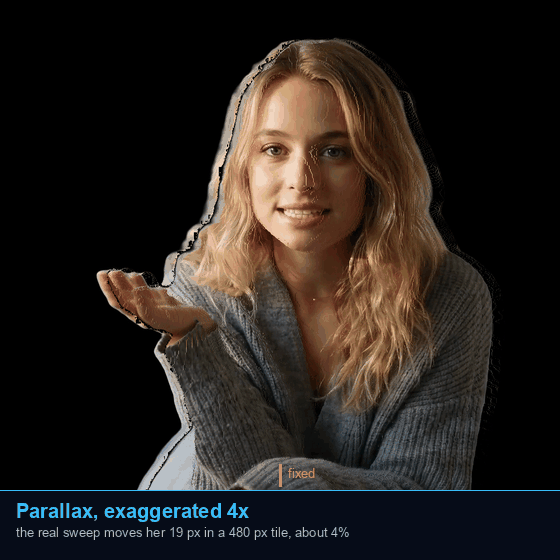
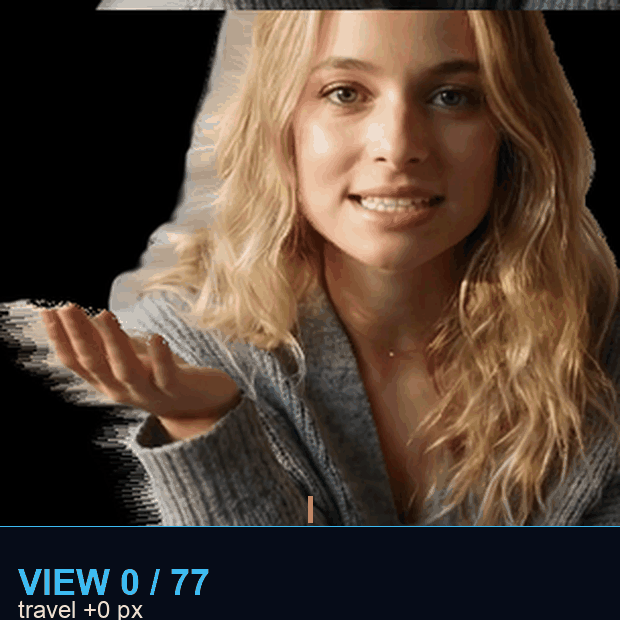
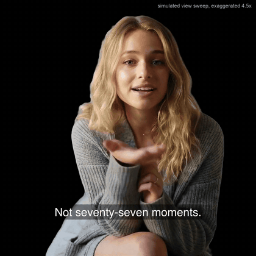

  

  
  
  
  
  
  

**An advertising-grade AI filmmaking pipeline where the evals are the product.**

| Who it is for | The difference |
|:---|:---|
| An ad team that cannot watch every render, because it runs on a schedule against metered APIs. [What changes for them](#an-ad-team-before-and-after) | The render path is not the hard part. Ten scoring models were built and killed in one day for disagreeing with the labels. [The five hard problems](#the-five-hard-problems-in-talking-head-video) |
| **The flow** | **The benchmark** |
| `label` then `derive` then `gate` then `render` then `relabel`. Nothing renders that the gates have not cleared | 16 of 16 named thresholds bracketed by labelled exemplars. [10 of 10 scheduled days, 0 missed](#what-holds-when-nobody-is-watching) |

**In plain words.** A computer writes a short ad script, speaks it in a cloned voice, and puts a generated person on camera to deliver it. Before it pays a vendor to render anything, it checks the work against examples a human graded by hand, and it refuses takes that do not measure up. It runs overnight, on a schedule, with nobody watching.

Three words repeat on this page, and they are one idea:

- a **probe** is a check
- a **threshold** is the line that check has to clear
- a **gate** is what stops the job when the line is not cleared

The hard part is not making the video. It is deciding, without a person in the room, whether the video is good enough to pay for. That decision is what this repository is.

<table>
  <tr>
    <td width="34%" align="center" valign="top">
       
      <b>Depth, on a flat screen.</b> A virtual camera sways across the inferred depth map, near pixels travelling further than far ones. <b>This clip is exaggerated 4x and says so on the frame.</b> The real sweep across all 77 views moves her <b>19 px</b> inside a 480 px tile, about 4 percent, which is honest and nearly invisible at this size. The amber tick is fixed, because without something stationary the eye tracks her and cancels the very displacement the clip exists to show.
    </td>
    <td width="33%" align="center" valign="top">
       
       
      <b>Six of the 77 views, one instant.</b> Spread across the whole sweep rather than neighbours, because adjacent views differ by <b>0.25 px</b> and a block of them reads as one photo repeated. These are warped at the full square framing rather than cropped out of the quilt, so they sit at the same scale as the clips beside them; the panel's own tiles trim top and bottom to a 1.57 aspect. Every frame of the clip carries its own 77. <b><a href="assets/quilt-video.mp4">&#9654; full quilt video</a></b>
    </td>
    <td width="33%" align="center" valign="top">
        
       
      <b>And she explains her own pipeline, in the final treatment.</b> The full narration under the simulated view sweep the first cell demonstrates, one pass, start to finish. This loop is her describing the very grid the middle cell shows: one moment, seventy-seven positions. GIFs are mute and the voice is half the point: <b><a href="assets/hologram-full.mp4">&#9654; watch with sound (2:49)</a></b>
    </td>
  </tr>
</table>

> The avatar is generated. She is not a real person and not a likeness of one. Her voice is a clone of a consented source. The three clips above and the frame study below come from **one** run of the pipeline, deliberately, because a montage of lucky takes would hide the thing this repo is about. The twelve short spots further down are twelve governed runs, one render each, and every one of them is scored on the same page.

---

## How this ran, and what it is actually showing

This branch is loop engineering applied to multi-modal AI generation, with the human on the loop, not in the loop. It is not a demo of multi-vendor ad generation; it is the repo's eval discipline running an entire ad production, end to end, with nobody driving. Ads are the first track because their feedback loops are shortest; documentary is next, and the light-field work on main is the third display target the same gated pipeline already feeds. The author wrote no scripts for this shoot. He supplied the architecture and the framework, the four-phase ad grammar held conceptually rather than literally, a realism guard paragraph, a rule that the most arresting beat opens the film, a rule that every human on screen is the same presenter, and the agent loop-engineered the rest, boards, prompts, engine calls, quality gates, re-rolls, remasters and delivery, with every request and landing in an append-only ledger.

The workflow is the industry's own systematic testing loop, run by an agent instead of a team.

| Phase | The industry step | What ran here |
|---|---|---|
| 01 | Hypothesis | The four-phase grammar and the hook-first rule, held as creative invariants |
| 02 | Ad variations | Five brands, four versions each, one variable moved per cell, the engine |
| 03 | Tests | Probes and judges gate every render before money moves, verdicts ledgered, defects withdrawn and re-rolled |
| 04 | Winners and iterate | The picked takes lead each row, the baseline's report card sits below, the next shoot inherits every ruling |

The measurements came from research, not taste. The offline gates on this page derive from labelled human verdicts, and the online success metrics the boards carry, hook rate, hold rate, view-through, come from a pairwise research pass over the ad industry's own testing literature. The evals were designed and calibrated before a single render was paid for.

## The conclusion, first

For a catalogue like this, the commercially viable path is the cheap engines with the gates left on. The probes below read the montage flags identically on the premium baseline and on every cheap reshoot, so those flags belong to the format, not to any engine. What actually separates the versions is character. Wan 3.0 renders story-bearing product text legibly, the sleep score, the For Sale sign. Omni Flash ships native ambient audio and the freest human motion. Seedance 2.0 is cleanest on crowds and refuses despair-adjacent scenes on content policy. The baseline still wins presenter identity, which is why her closers stay vendor-rendered inside every version. And the margin is the point, a few dollars of scenes per spot per engine against the baseline's credit bill makes a four-deep variant pool affordable per spot, so an ad platform can serve each user the version that user responds to, which is what the pool is for.

| Version | Engine | What the scenes cost |
|---|---|---|
| A0 | HeyGen video agent, the baseline | 116 vendor credits for its sixteen scenes and seven closers, read off the balance |
| B1 | Omni Flash | about sixty cents a scene, nine dollars for its fifteen |
| B2 and B3 | Wan 3.0 and Seedance 2.0 | about thirty-two dollars together for their thirty scenes, roughly a dollar a scene |

## The five spots, four ways each, probed

Every spot in all four versions, inline, with the advertising subset of the probe battery under each row and the winner declared. The full battery ran on all twenty versions; the structural rows, level wander and scene simplicity, read the same on every version because a montage wanders by construction, so for this category they report rather than gate and stay off the tables. Read every table the same way. The first two rows measure clutter and want LOW numbers, under their bars. The gesture row measures energy and wants HIGH, an ad sells with motion. Bold is a reading past its bar. A winner is the best BALANCE under the advertising subset, so a row can win while carrying a flag when its flag is the smallest and its strengths are the largest. The measured winners agreed with the earlier blind eye picks on all five rows.

### Orchard Hill Coffee

<table>
  <tr>
    <td width="25%" align="center" valign="top"> <b>A0 &middot; HeyGen, the baseline.</b> <a href="https://github.com/jameswniu/3d-filmmaking-ads-multimodal-evals/raw/archive-media/shoot-20260822-ad2-orchard.mp4">&#9654; with sound</a></td>
    <td width="25%" align="center" valign="top"> <b>B1 &middot; Omni Flash, the winner.</b> <a href="https://github.com/jameswniu/3d-filmmaking-ads-multimodal-evals/raw/archive-media/shoot-20260824-omni-orchard.mp4">&#9654; with sound</a></td>
    <td width="25%" align="center" valign="top"> <b>B2 &middot; Wan 3.0.</b> <a href="https://github.com/jameswniu/3d-filmmaking-ads-multimodal-evals/raw/archive-media/shoot-20260824-wan3-orchard.mp4">&#9654; with sound</a></td>
    <td width="25%" align="center" valign="top"> <b>B3 &middot; Seedance 2.0.</b> <a href="https://github.com/jameswniu/3d-filmmaking-ads-multimodal-evals/raw/archive-media/shoot-20260824-seedance2-orchard.mp4">&#9654; with sound</a></td>
  </tr>
</table>

| Probe | A0 HeyGen, the baseline | **B1 Omni Flash, the winner** | B2 Wan 3.0 | B3 Seedance 2.0 |
|---|---|---|---|---|
| background clutter, lower is better, passes under 5.5 | 4.89 | 3.52 | 5.15 | **6.57** |
| eye rejection, lower is better, passes under 4.5 | **9.86** | **8.68** | **12.79** | **7.69** |
| gesture energy, higher is better, a frozen talking head is 0.2 | 0.468 | 0.609 | 0.787 | 0.664 |

**B1 Omni Flash wins, the only background inside the pass band and the biggest smoke gag.** [&#9654; Watch the winner](https://github.com/jameswniu/3d-filmmaking-ads-multimodal-evals/raw/archive-media/shoot-20260824-omni-orchard.mp4), about twenty seconds with sound.

### Lantern Street

<table>
  <tr>
    <td width="25%" align="center" valign="top"> <b>A0 &middot; HeyGen, the baseline.</b> <a href="https://github.com/jameswniu/3d-filmmaking-ads-multimodal-evals/raw/archive-media/shoot-20260822-ad2-lantern.mp4">&#9654; with sound</a></td>
    <td width="25%" align="center" valign="top"> <b>B1 &middot; Omni Flash.</b> <a href="https://github.com/jameswniu/3d-filmmaking-ads-multimodal-evals/raw/archive-media/shoot-20260824-omni-lantern.mp4">&#9654; with sound</a></td>
    <td width="25%" align="center" valign="top"> <b>B2 &middot; Wan 3.0, the winner.</b> <a href="https://github.com/jameswniu/3d-filmmaking-ads-multimodal-evals/raw/archive-media/shoot-20260824-wan3-lantern.mp4">&#9654; with sound</a></td>
    <td width="25%" align="center" valign="top"> <b>B3 &middot; Seedance 2.0.</b> <a href="https://github.com/jameswniu/3d-filmmaking-ads-multimodal-evals/raw/archive-media/shoot-20260824-seedance2-lantern.mp4">&#9654; with sound</a></td>
  </tr>
</table>

| Probe | A0 HeyGen, the baseline | B1 Omni Flash | **B2 Wan 3.0, the winner** | B3 Seedance 2.0 |
|---|---|---|---|---|
| background clutter, lower is better, passes under 5.5 | 2.75 | 4.08 | 3.95 | **6.5** |
| eye rejection, lower is better, passes under 4.5 | **5.58** | **6.46** | 4.01 | 3.56 |
| gesture energy, higher is better, a frozen talking head is 0.2 | 0.433 | 0.411 | 0.547 | 0.514 |

**B2 Wan 3.0 wins, the only version with the system banner legibly on the phone, and an eye pass.** [&#9654; Watch the winner](https://github.com/jameswniu/3d-filmmaking-ads-multimodal-evals/raw/archive-media/shoot-20260824-wan3-lantern.mp4), about twenty seconds with sound.

### Harbor Lane Realty

<table>
  <tr>
    <td width="25%" align="center" valign="top"> <b>A0 &middot; HeyGen, the baseline.</b> <a href="https://github.com/jameswniu/3d-filmmaking-ads-multimodal-evals/raw/archive-media/shoot-20260822-ad2-harbor-maya.mp4">&#9654; with sound</a></td>
    <td width="25%" align="center" valign="top"> <b>B1 &middot; Omni Flash.</b> <a href="https://github.com/jameswniu/3d-filmmaking-ads-multimodal-evals/raw/archive-media/shoot-20260824-omni-harbor.mp4">&#9654; with sound</a></td>
    <td width="25%" align="center" valign="top"> <b>B2 &middot; Wan 3.0.</b> <a href="https://github.com/jameswniu/3d-filmmaking-ads-multimodal-evals/raw/archive-media/shoot-20260824-wan3-harbor.mp4">&#9654; with sound</a></td>
    <td width="25%" align="center" valign="top"> <b>B3 &middot; Seedance 2.0, the winner.</b> <a href="https://github.com/jameswniu/3d-filmmaking-ads-multimodal-evals/raw/archive-media/shoot-20260824-seedance2-harbor.mp4">&#9654; with sound</a></td>
  </tr>
</table>

| Probe | A0 HeyGen, the baseline | B1 Omni Flash | B2 Wan 3.0 | **B3 Seedance 2.0, the winner** |
|---|---|---|---|---|
| background clutter, lower is better, passes under 5.5 | 3.65 | **6.6** | **10.5** | **6.4** |
| eye rejection, lower is better, passes under 4.5 | **11.5** | **5.95** | **9.05** | **7.05** |
| gesture energy, higher is better, a frozen talking head is 0.2 | 0.71 | 0.694 | 0.729 | 0.523 |

**B3 Seedance 2.0 wins, the cleanest For Sale sign and the least flagged background of the cheap takes.** [&#9654; Watch the winner](https://github.com/jameswniu/3d-filmmaking-ads-multimodal-evals/raw/archive-media/shoot-20260824-seedance2-harbor.mp4), about twenty seconds with sound.

### Quiet Hours

<table>
  <tr>
    <td width="25%" align="center" valign="top"> <b>A0 &middot; HeyGen, the baseline.</b> <a href="https://github.com/jameswniu/3d-filmmaking-ads-multimodal-evals/raw/archive-media/shoot-20260822-ad2-quiet.mp4">&#9654; with sound</a></td>
    <td width="25%" align="center" valign="top"> <b>B1 &middot; Omni Flash.</b> <a href="https://github.com/jameswniu/3d-filmmaking-ads-multimodal-evals/raw/archive-media/shoot-20260824-omni-quiet.mp4">&#9654; with sound</a></td>
    <td width="25%" align="center" valign="top"> <b>B2 &middot; Wan 3.0, the winner.</b> <a href="https://github.com/jameswniu/3d-filmmaking-ads-multimodal-evals/raw/archive-media/shoot-20260824-wan3-quiet.mp4">&#9654; with sound</a></td>
    <td width="25%" align="center" valign="top"> <b>B3 &middot; Seedance 2.0.</b> <a href="https://github.com/jameswniu/3d-filmmaking-ads-multimodal-evals/raw/archive-media/shoot-20260824-seedance2-quiet.mp4">&#9654; with sound</a></td>
  </tr>
</table>

| Probe | A0 HeyGen, the baseline | B1 Omni Flash | **B2 Wan 3.0, the winner** | B3 Seedance 2.0 |
|---|---|---|---|---|
| background clutter, lower is better, passes under 5.5 | 1.3 | 4.64 | **6.76** | 5.43 |
| eye rejection, lower is better, passes under 4.5 | 4.46 | **6.69** | **7.09** | **6.16** |
| gesture energy, higher is better, a frozen talking head is 0.2 | 0.463 | 0.804 | 0.628 | 0.544 |

**B2 Wan 3.0 wins, the only legible sleep score, the beat the spot turns on.** [&#9654; Watch the winner](https://github.com/jameswniu/3d-filmmaking-ads-multimodal-evals/raw/archive-media/shoot-20260824-wan3-quiet.mp4), about twenty seconds with sound.

### Slow Road Travel

<table>
  <tr>
    <td width="25%" align="center" valign="top"> <b>A0 &middot; HeyGen, the baseline.</b> <a href="https://github.com/jameswniu/3d-filmmaking-ads-multimodal-evals/raw/archive-media/shoot-20260822-ad2-slowroad.mp4">&#9654; with sound</a></td>
    <td width="25%" align="center" valign="top"> <b>B1 &middot; Omni Flash, the winner.</b> <a href="https://github.com/jameswniu/3d-filmmaking-ads-multimodal-evals/raw/archive-media/shoot-20260824-omni-slowroad.mp4">&#9654; with sound</a></td>
    <td width="25%" align="center" valign="top"> <b>B2 &middot; Wan 3.0.</b> <a href="https://github.com/jameswniu/3d-filmmaking-ads-multimodal-evals/raw/archive-media/shoot-20260824-wan3-slowroad.mp4">&#9654; with sound</a></td>
    <td width="25%" align="center" valign="top"> <b>B3 &middot; Seedance 2.0.</b> <a href="https://github.com/jameswniu/3d-filmmaking-ads-multimodal-evals/raw/archive-media/shoot-20260824-seedance2-slowroad.mp4">&#9654; with sound</a></td>
  </tr>
</table>

| Probe | A0 HeyGen, the baseline | **B1 Omni Flash, the winner** | B2 Wan 3.0 | B3 Seedance 2.0 |
|---|---|---|---|---|
| background clutter, lower is better, passes under 5.5 | **8.54** | **6.07** | **12.28** | **7.07** |
| eye rejection, lower is better, passes under 4.5 | **7.37** | **6.55** | **8.79** | **5.91** |
| gesture energy, higher is better, a frozen talking head is 0.2 | 0.681 | 0.847 | 0.918 | 0.712 |

**B1 Omni Flash wins, near-top gesture with the only near-band background.** [&#9654; Watch the winner](https://github.com/jameswniu/3d-filmmaking-ads-multimodal-evals/raw/archive-media/shoot-20260824-omni-slowroad.mp4), about twenty seconds with sound.

The pipeline and the evals that gate every render live on [main](https://github.com/jameswniu/3d-filmmaking-ads-multimodal-evals).

### Scored, failures first

| Clip | Flags | sync lag ms | lipsync | level face / scene / relation | eye bg (max 4.5) | scene (target 7.5) | bg detail (max 5.5) | hand ratio |
|---|---|---|---|---|---|---|---|---|
| ad2-harbor-elena | 5 | **240 late** | **FAIL** | **249.5 / 190.3 / 35.8** | **11.32** | **n/a** | 3.21 | 0.739 |
| take-loop | 4 | **240 late** | **FAIL** | **7.1 / 4.9 / 22.1** | **4.79** | 5.30 | 4.27 | 0.248 |
| take-prison | 4 | **160 late** | **FAIL** | **7.8 / 5.2 / 21.5** | **5.00** | 5.52 | 4.27 | 0.246 |
| ad2-harbor-daniel | 4 | -240 early | **FAIL** | **250.0 / 190.2 / 42.6** | **11.32** | **n/a** | 3.21 | 0.709 |
| ad2-harbor-maya | 4 | -240 early | **FAIL** | **250.0 / 190.2 / 42.1** | **11.32** | **n/a** | 3.21 | 0.713 |
| ad2-orchard | 4 | -240 early | **FAIL** | **148.7 / 107.7 / 111.0** | **9.53** | **n/a** | 4.52 | 0.471 |
| ad2-slowroad | 4 | n/a | **FAIL** | **136.2 / 139.7 / 116.6** | **7.07** | 6.98 | **8.36** | 0.686 |
| take-plausible | 3 | n/a | **FAIL** | **8.6 / 4.8 / 17.3** | **4.76** | 5.49 | 4.40 | 0.238 |
| film-image | 3 | -240 early | PASS | **170.4 / 167.9 / 130.8** | **5.73** | 7.06 | **7.11** | 0.674 |
| ad2-lantern | 3 | -240 early | **FAIL** | **150.1 / 94.4 / 66.5** | **5.29** | 4.18 | 2.30 | 0.437 |
| take-copy | 2 | n/a | n/a | **8.2 / 5.0 / 17.0** | **4.82** | 5.38 | 4.27 | 0.248 |
| take-image | 2 | -240 early | **FAIL** | **8.5 / 4.4 / 17.0** | 4.32 | 5.49 | 4.26 | 0.238 |
| ad2-quiet | 2 | -240 early | **FAIL** | **123.0 / 147.1 / 149.8** | 4.16 | 3.68 | 0.86 | 0.465 |

The readings come from the same probes that score the hero render higher on this page, run on the masters before the web encode. A value in bold is a reading the probe itself flagged. Separation is not shown because these clips are unmatted, so there is no fill to measure against, and the spasm ratios are disclosures rather than verdicts and stay in the probe log. The remade spots score the way montages score: the level probe reads every hard cut as luminance wander, and the lip-sync probe watches crowd scenes where nobody on camera is the narrator, so its verdict fails even where her own closer is in time. The brokerage variants are three rows because they are three renders, and their third scene runs at 1.26x slow motion because the line outran the footage, which is the kind of call an edit makes and a probe then bills it for. The one re-roll of the batch was the software spot's third scene, regenerated for a clearer product beat after the first take came back as a close-up of the cat.
 the same probes that score the hero render on main, run on the A0 baseline masters before the web encode. This is the page's floor, the report card the cheap versions are measured against.
