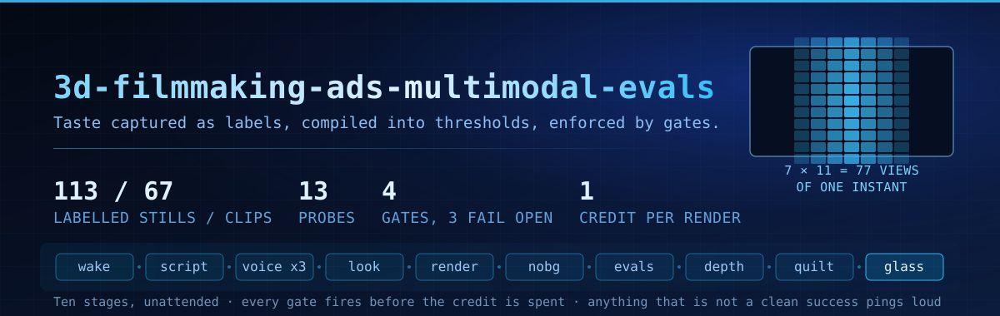
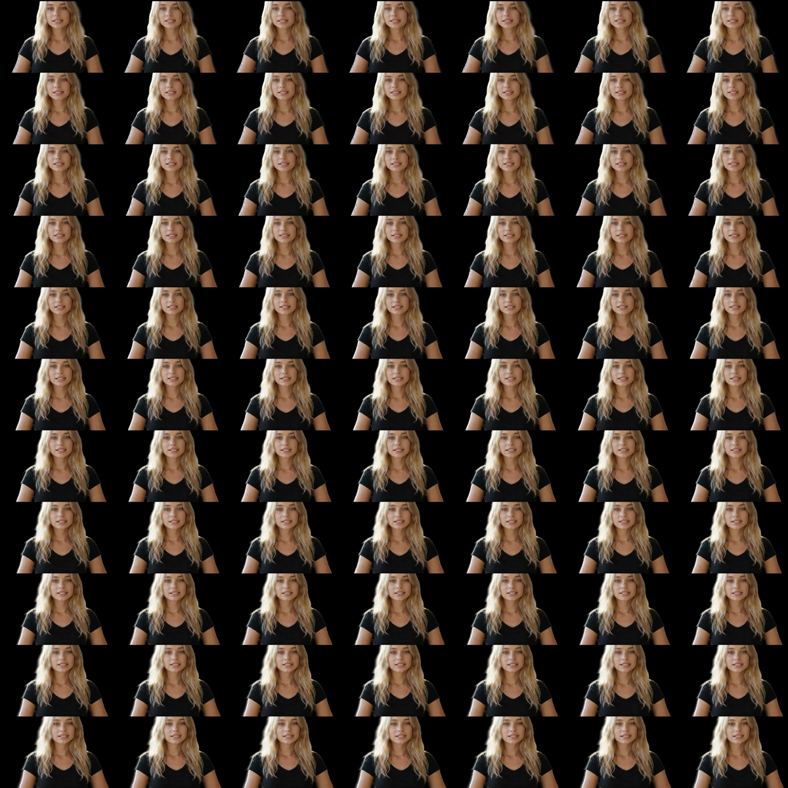
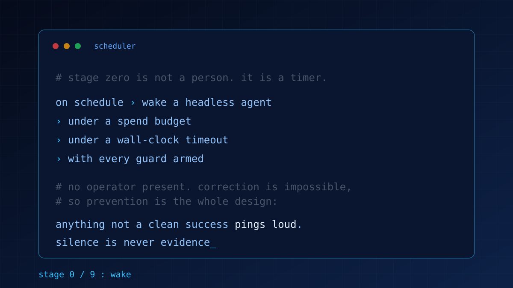
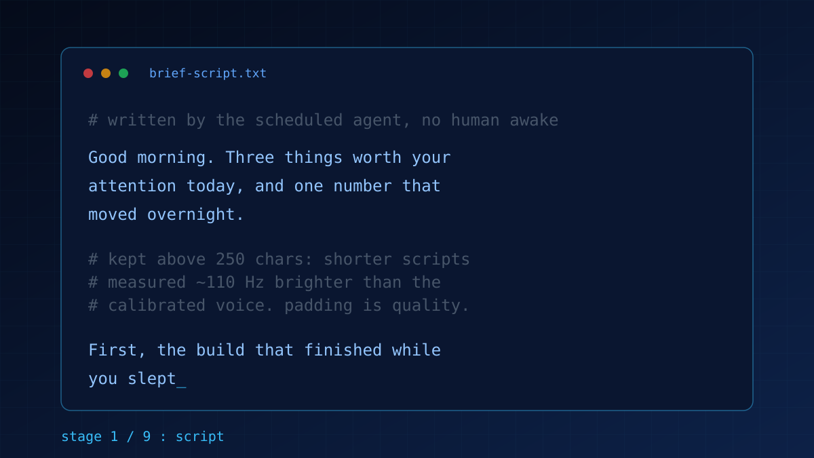
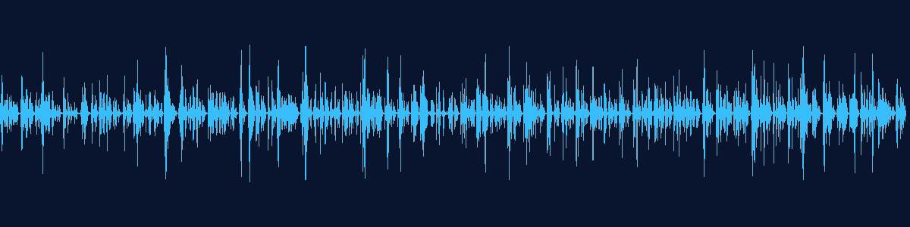
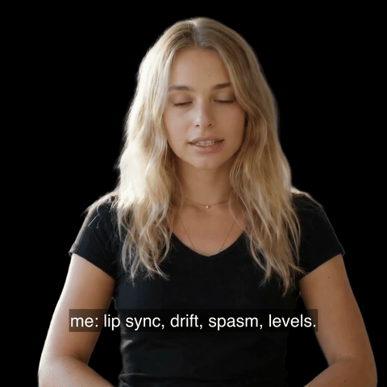
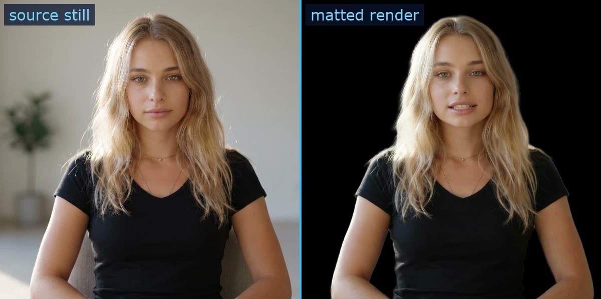
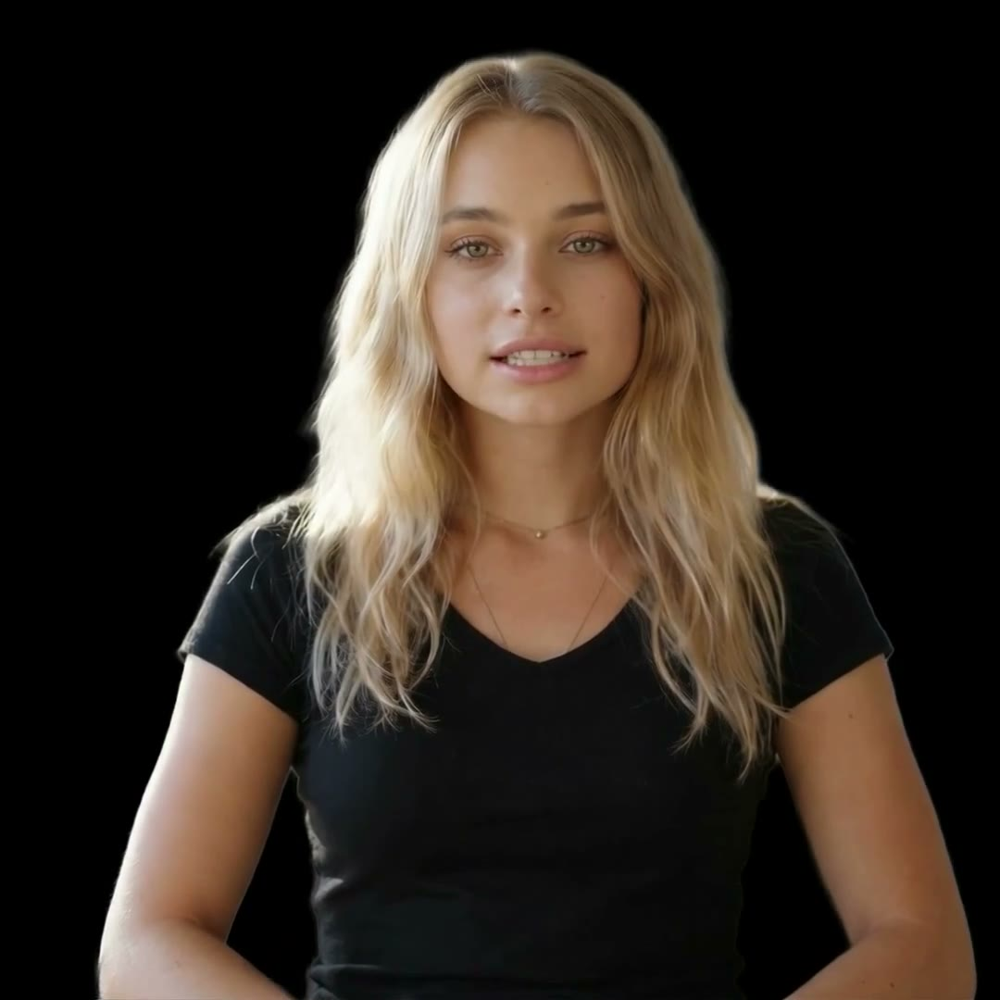
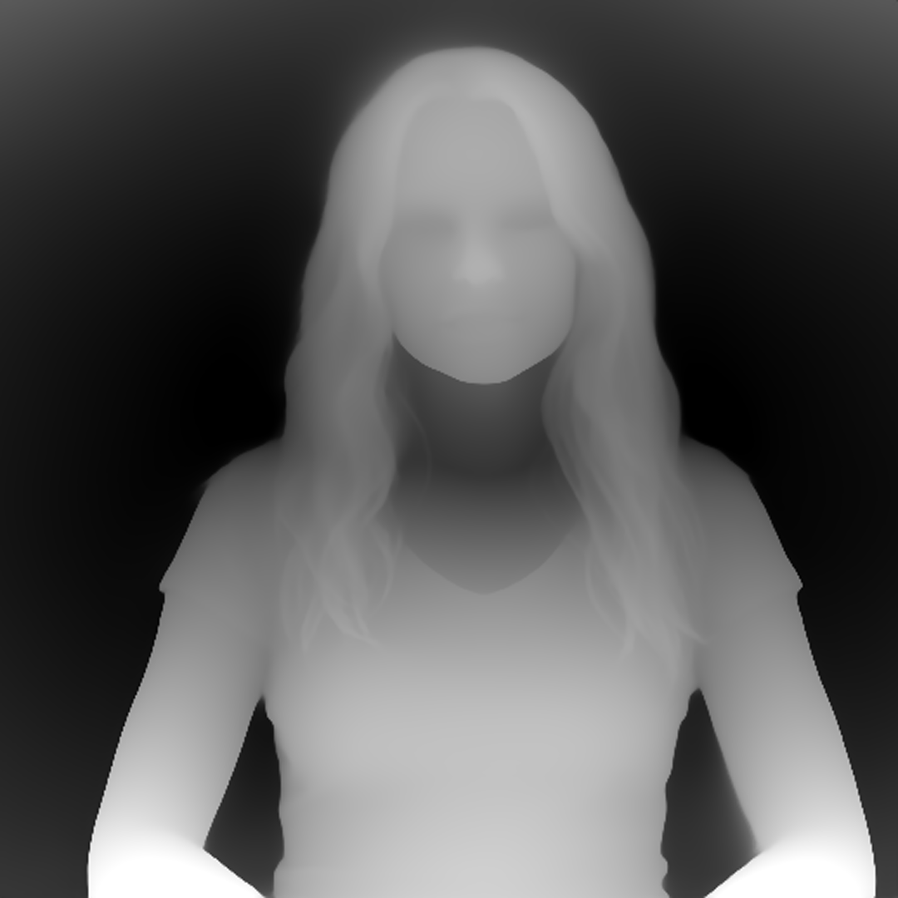

<p align="center">
  
</p>

<p align="center">
  
  
  
  
  
  
</p>

**An advertising-grade AI filmmaking pipeline where the evals are the product.** It writes a script, speaks it in a cloned voice, renders a consistent generated presenter, separates her from her background, infers depth, and emits 77 views of a single instant for a light-field display. It does this on a schedule, against metered vendor APIs, with nobody watching. What makes that survivable is not the render path. It is that one person's taste was captured as labels, compiled into thresholds, and wired into gates that can refuse to spend.

<table>
  <tr>
    <td width="55%" align="center">
      <br>
      <sub><b>The product, one pass, start to finish.</b> She is explaining the pipeline that renders her. GIFs are mute and the voice is half the point, so: <b><a href="assets/glass-feed-demo.mp4">&#9654; watch it with sound (2:08 mp4)</a></b></sub>
    </td>
    <td width="45%" align="center">
      <br>
      <sub><b>The same instant, 77 times.</b> One frame of that clip as its 7x11 quilt: 77 camera positions across the view cone, which is what the panel turns back into depth.</sub>
    </td>
  </tr>
</table>

> The presenter is generated. She is not a real person and not a likeness of one. Her voice is a clone of a consented source. Every asset on this page comes from **one** run of the pipeline, deliberately, because a montage of lucky takes would hide the thing this repo is about.

---

## Evals lead this

A wrong number in a chart fails loudly. A generated human fails **plausibly**: hair that fuzzes at the edge, a mouth trailing the audio by four frames, a gesture landing after the word it belonged to, eyes holding too still for thirty seconds. Each is invisible to a type check, obvious to a person, and different in tomorrow's draw. And nobody is awake at render time.

So the pipeline's real job is to make a human eye present at render time by having captured it earlier:

```
label  ->  derive  ->  gate  ->  render  ->  relabel
```

**Label.** 113 hand-labelled stills. 67 labelled clips. 174 frame-level identity records. 677 pairwise A/B verdicts. A render ledger of 14 renders, 7 kept and 3 rejected. Plain-language verdicts, kept as data.

**Derive.** Every threshold in [`probes/`](probes/) comes from a labelled pass exemplar and a labelled fail exemplar. Never typed. The surviving eye model's background bar (4.5) sits between the worst labelled pass (3.30) and the best labelled reject (5.32), and its self-test exits nonzero unless it agrees with the labels 100 percent.

**Gate.** Thresholds become guards that run before money is spent. Judging is blind. Gates are ranked by what happens when they are violated, which is why the same constraint held 14 of 15 runs at the outcome and only 6 of 15 at the first attempt: the gap is a pre-call hook, not better prose.

**Relabel.** Ten scoring models were built in one day and every one inverted against the labels. A lip-sync metric agreed with the eye 8 times out of 8, was wired in as a blocker within minutes, then measured 6 to 10 frames of swing against itself inside a single clip and was demoted the same hour. A brightness bar set to 8.0 because one engine's clip measured 7.9 turned out to mean *resemble that engine*, and steered choices for six hours while gating nothing. Thirteen metrics found nothing about gesture timing until the human said the movement lags the speech, and the literature explained why: gesture aligns to pitch accents as discrete events, so a late one is caught at about 200 milliseconds while an early one is forgiven.

**Full doctrine, with every number and every retraction: [`docs/EVALS.md`](docs/EVALS.md).**

## The clip above, scored by this repo's own probes

Not a claim that it is good. The output of the gates that let it ship.

| probe | reading | bar |
|---|---|---|
| `sync_probe` | lag **-200ms**, early side, IN BAND | late fails at +80ms; early is forgiven |
| `level_probe` | face 7.6, scene 0.7, face-vs-body 8.7, CONSTANT | 8.0 / 5.0 / 12.5 |
| `drift_probe` | PASS, every corner | textureless black gives nothing to track |
| `scene_simplicity` | 3.61 SIMPLE | target 7.5; the cleanest measured clip ran 2.68 |
| `bg_detail` | 1.93 | labelled passes 3.61 to 4.27; labelled rejects 7.05 to 12.06 |
| `spasm_probe` | energy 2.02, ratio 0.63 | **reported, not judged**, per the retraction above |

Pre-spend, the same run: voice drawn 3 times (128.08 / 128.16 / 124.16s, median kept, 3.2 percent spread), transcript diffed against the script before any render, a 0.6s settle beat added, the generated look scored at `bg_detail 2.03` and attested against the frozen-prop rule, and identity checked against the pin allowlist of 279 approved looks.

**One honest asterisk, which is the whole point of the repo.** Three renders of this identical still and audio were produced on three engine tiers. `level_probe` separated them cleanly, passing one and flagging the other two. That probe's face bar is 8.0, and 8.0 was originally calibrated against a clip from one specific engine that measured 7.9. So the metric that separated the trio is the one already documented above as circular. The pick therefore rests on a marginal sync edge and on the eye, not on that probe, and the three were near-identical at frame level anyway, exactly as this repo's own draw-versus-look finding predicts.

---

## Four separations

The filmmaking claim, in one frame: this is not one generative model producing a video. It is four separations, each independently gated, which is what makes any of it controllable.

| | what comes apart | why it matters | governed by |
|---|---|---|---|
| **1** | **The voice from the animation.** Audio is synthesized first and drives the render, never the reverse. | The performance is fixed and inspectable before a frame exists. A bad read costs characters, not credits. | 3-draw median, transcript diff, settle beat |
| **2** | **The person from the background.** A matting pass lifts her off the room. | Anything frozen behind her betrays the frame as dead; removing it removes the tell. Hair is where this is won or lost. | `bg_detail`, matte tuning |
| **3** | **The depth from the flat image.** A monocular model infers geometry no camera captured. | One rendered frame becomes a scene with distance in it. This is where 2D becomes 3D. | depth inference on local GPU |
| **4** | **One view into seventy seven.** The warp samples 77 camera positions across the display's view cone. | The panel needs every eye position at once. A flat frame cannot hold parallax; a view array can. | quilt geometry, `drift_probe` |

Separation is why the evals can exist at all. A single end-to-end model would leave nothing to measure between the prompt and the pixels.

---

## The suite, stage by stage

Ten stages. Each gets three layers: **conceptual** (the decision anyone building this has to make), **structural** (what I chose and the measured reason), **physical** (the literal steps). Every image below is from the single run at the top of this page.

<table>
  <tr>
    <td width="33%" align="center"></td>
    <td width="33%" align="center"></td>
    <td width="33%" align="center"></td>
  </tr>
</table>

### 0. Wake

- **Conceptual.** Supervised or unattended? Everything downstream follows from this. A supervised pipeline can be corrected mid-flight and needs no gates; an unattended one cannot, and needs all of them.
- **Structural.** Unattended, on a timer, because the interesting failures only appear when nobody is watching. Each run is a headless agent under a spend budget and a wall-clock timeout.
- **Physical.** A scheduled job fires the run, a lock prevents two runs racing, a budget guard caps spend, a timeout kills a wedged leg. The alert test is inverted deliberately: it fires on everything that is not a clean success, rather than on an enumerated list of known failures, so a novel failure is loud on day one.

### 1. Script

- **Conceptual.** Whose words? Generic ad copy is safe and forgettable; real material is specific and risky. In production the script is written from my own working notes and roadmaps, which is the difference between a presenter reading marketing and a presenter saying something.
- **Structural.** A separate script-author agent owns the words, on the principle that the thing writing the copy should not also be the thing spending the render budget. *(That agent has its own repository. Available on request.)* The clip on this page is the deliberate exception, and says so: for a public demo she explains the pipeline itself rather than anything private.
- **Physical.** Script written, then held above 250 characters, because shorter scripts measured about 110 Hz brighter and less consistent on this voice. Padding a short script is quality control, not filler.

### 2. Voice

- **Conceptual.** Clone a real voice or use a licensed synthetic one? Cloning is better and carries a consent obligation that never expires: clone only your own voice, or one whose owner gave written permission.
- **Structural.** An instant clone from a single **continuous** source take. More audio lost this argument twice: a 69-second stitched reference pitched the voice up (242 and 235 Hz against 216) and scored lower on timbre similarity (0.857 to 0.867 against 0.925 to 0.939) than a 10-second continuous original, and its clips were then rejected by ear independently. Continuity of the source beat quantity of it. Fourteen candidate clones were built; the final pick was made by ear on a grid that moved exactly one variable, and the runner-up measured 0.08 percent away, so the design made it legible that this was taste.
- **Physical.** Draw 3 takes of the same script and keep the **median by duration**, since a single blind draw lands somewhere on a 6 to 37 percent spread and roughly one in three lands on a tail. Transcribe the winner and diff it against the intended script, because proper nouns are where synthesis fails and no render can fix audio that was already wrong. Add a 0.6-second settle beat, since the synthesizer returns zero trailing silence and the render ends exactly at the audio, leaving a mouth mid-motion on the final frame.

<table>
  <tr>
    <td width="33%" align="center"></td>
    <td width="33%" align="center"></td>
    <td width="33%" align="center"></td>
  </tr>
</table>

### 3. Look

- **Conceptual.** Your own footage or a generated character? Own footage means filming yourself: a real face, at the cost of about two minutes of usable material and a consent step. A generated character means no shoot, unlimited wardrobe, and a permanent disclosure obligation. This pipeline uses a generated character and discloses it on every public surface.
- **Structural.** A prompt-generated look, always anchored to one pinned identity group, so all 279 approved looks are provably the same person. A frontier image model can supply a reference still instead, when a text prompt will not hold the art direction. The live interactive variant, which needs a two-minute training video of a real person, is deliberately **parked at its consent gate**: a human confirms the person in the footage is themselves, and no agent is allowed to click that.
- **Physical.** Generate the look, then judge it before spending: `bg_detail` must clear the labelled band, and a frozen-prop probe asks whether anything in frame becomes implausible if it never moves for thirty seconds (a steaming cup fails; a plant is fine). Then the identity guard checks the look against the pin allowlist. **Say nothing about hands.** Five successive hand-posing rules each produced a rejected clip within one render, because the engine drives mouth and head from the audio while hands free-run, so mandated hand activity is motion uncorrelated with speech.

### 4. Render

- **Conceptual.** Text-to-video or audio-driven avatar? General video models are spectacular and unpredictable per frame; an audio-driven avatar is narrow, repeatable, and cheap enough to run daily. For advertising work, where the same presenter must appear identical on Tuesday and Thursday, repeatability wins.
- **Structural.** Audio drives the animation from a fixed still, which is the only reproducibility control available: the vendor exposes no seed, so the still *is* the seed. The flat-rate tier is the scheduled default because it bills the same for a 9-second clip as for a 2-minute one.
- **Physical.** Upload the finished audio as an asset, create the video against the pinned look, poll for completion, download, square-crop, burn subtitles. The clip on this page ran 128.66 seconds.

<table>
  <tr>
    <td width="33%" align="center"></td>
    <td width="33%" align="center"></td>
    <td width="33%" align="center" valign="middle"><sub><b>8. Quilt</b> and <b>9. Glass</b> are the pair at the top of this page: the 77-view array, and the panel that turns it back into depth.</sub></td>
  </tr>
</table>

### 5. Matte

- **Conceptual.** Keep the room or separate the person? Keeping it is free and reads as dead, because the engine animates only her and every frozen edge behind her becomes a tell. Separating her costs a matting pass and buys a background you control completely.
- **Structural.** A matting pass to pure black, tuned specifically at the hair, which is where every earlier attempt failed. Black is the one solid fill that reads as intentional; a colored fill behind a matted head reads as a cheap green screen, a mistake this pipeline shipped exactly once.
- **Physical.** [`pipeline/matte_video.py`](pipeline/matte_video.py), which carries its own dated tuning history in comments, including the verdicts that moved each threshold.

### 6. Evals

- **Conceptual.** Gate on the outcome or on the attempt? Outcome metrics are what dashboards show, and they cannot distinguish a system that complied from a system that was stopped.
- **Structural.** Nine invariants, twelve probes, thresholds derived from labelled exemplars, blind judging, and a hard separation between metrics that **gate** and metrics that **report**. A metric must be stable within a single clip before it earns authority over spend.
- **Physical.** Probes run against the rendered clip and its subtitle track; the ship gate refuses to pass on geometry failures and demands an explicit reason for judgement calls it cannot make itself. Every threshold's derivation is in [`docs/EVALS.md`](docs/EVALS.md).

### 7. Depth

- **Conceptual.** Capture depth or infer it? Capture needs a depth camera and a real subject, neither of which exists here, since the subject was generated. Inference works on any frame including a synthetic one, and is the only option that composes with a generated presenter.
- **Structural.** Monocular depth estimation running **locally** on the GPU (Apple Silicon MPS), not through a cloud API, because it runs on every frame of every clip and a per-frame API call would price the pipeline out of daily use.
- **Physical.** [`pipeline/depth_infer.py`](pipeline/depth_infer.py). On the frame above: model load 1.9 seconds, inference 0.4 seconds. Batched with a stride and interpolated between, which is where the measured pipeline speedup actually comes from.

### 8. Quilt

- **Conceptual.** Ship a flat frame or a view array? A flat frame is universally compatible and cannot hold parallax. A view array only works on light-field hardware, and it decouples the render path from the display: change the panel, change the geometry, leave the renderer alone.
- **Structural.** 7 columns by 11 rows, 77 views, sampled across the display's view cone by a parallax warp driven by the depth map.
- **Physical.** [`pipeline/quilt.py`](pipeline/quilt.py), 77 views in 0.8 seconds at 3360 by 3360. The geometry is a flag now, and that is a fix: the constants were pinned at the legacy 8 by 6 (48 views) while production had moved to 7 by 11, and a hardcoded constant cannot disagree with the pipeline around it, so nothing failed. The output was simply built at a geometry the display no longer expected.

### 9. Glass

- **Conceptual.** Screen or light field? A screen is everywhere, and flat. A light-field panel is one device on one desk, and holds real depth, which is the entire reason the previous nine stages are shaped the way they are.
- **Structural.** The panel is fed the quilt and does the lenticular work itself. Failures degrade to a known-good clip rather than showing a broken frame, and the degradation pings rather than passing silently.
- **Physical.** Transfer the quilt and cast. A pre-ship gate checks the delivered geometry, since a letterboxed clip on this panel is a hard failure.

---

## What I found by measuring it

The general lesson on the left, what actually happened on the right.

| | |
|---|---|
| **Count attempts, not outcomes.** | "I asked the AI to follow a rule and it ignored me. I stopped asking and put the rule in code instead, where it can't be negotiated with. It held every time after that, and the first thing it blocked was me." |
| **A metric that agrees with you isn't a metric yet.** | "One check matched my eye 8 times out of 8, so I wired it in to block bad renders. Then I measured the same clip in thirds and it disagreed with itself by up to 10 frames. Demoted it within the hour." |
| **Your threshold might just mean 'look like last time'.** | "A brightness limit was set from one clip that scored 7.9. Later, every good clip was failing it. The number didn't mean 'looks right', it meant 'looks like that one clip', and it had been steering me for hours." |
| **Delete its config. Still passes? Not a check.** | "I had four safety checks, so I broke them on purpose. Three approved everything when a single config file went missing, and still showed green. Two of those three had no idea they were doing it." |
| **Benchmarks prove speed, not cause.** | "I made it 2.5x faster and wrote down why. Later I checked production and the speedup was real but my explanation wasn't, and the setting meant to run ten things at once was running one." |
| **When every predictor inverts, stop predicting.** | "In one day I built ten ways to score these clips and every single one disagreed with my own eyes. So I switched to picking at random and went back to labelling by hand. The models were confidently wrong; random at least knows it isn't." |
| **No stopwatch, no saving.** | "Half an hour, start to finish, with nobody watching it. I won't tell you what that saves, because I never put a stopwatch on a human doing it by hand, and a number I made up is the easiest thing here to get caught on." |

Most of those are me finding my own work was not what I had written down. That is the point of the repo.

---

## The numbers

Measured, not estimated. Every figure carries its sample size, because a rate without a denominator is decoration.

| | | |
|---|---|---|
| Labelled stills / clips | 113 / 67 | hand-curated |
| Identity label records | 174 (115 `her`, 59 `not_her`) | plus an earlier 171-record pass, kept |
| A/B verdicts logged | 677 | pairwise |
| Approved looks, one identity | 279 | pin allowlist |
| Scoring models built and killed | 10 in one day | every one inverted on the labels |
| Runs on schedule | 10 of 10 consecutive days, 0 missed | n=10 days |
| Full chain completion | 4 of 7 | n=7, across 2 days |
| Constraint held, outcome vs first attempt | 14 of 15 vs 6 of 15 | n=15 |
| Quality gate true positives | 0 of 7 evaluations | n=7 |
| Voice draw spread, this clip | 3.2 percent across 3 draws | median kept |
| Depth on one frame | load 1.9s, inference 0.4s | local GPU |
| Quilt build | 77 views in 0.8s at 3360px | n=1 |
| Demo run cost | 89 credits | balance measured before and after |

**What I cannot tell you:** any dollar figure, because no credit-to-currency rate was recorded at measurement time. Time saved, because no manual baseline was ever measured. Both are in [`docs/NOT-MEASURED.md`](docs/NOT-MEASURED.md) with what it would take to get them honestly.

**Honest scope:** one operator, one machine, one panel, one labeller. The labels are internally consistent and externally unvalidated, and a second labeller is the single most valuable thing this repository is missing.

---

## Cost

The scheduled pipeline renders on the **flat tier**: 1 credit, measured at both 11 seconds and 125.7 seconds. The premium tiers billed 5 credits at 11 seconds and 43 at 125.7, so the multiple on a 2-minute clip is 43x, not 5x.

| engine tier | ~11s | ~126s | shape |
|---|---|---|---|
| flat tier (scheduled default) | 1 credit | 1 credit | flat with length, two measured points |
| premium tiers | 5 credits | 43 credits | scales, and not knowably linear |

The cost router refuses to interpolate between measured points, because an earlier confident estimate understated a premium batch by 8.6x and burned 344 credits before anyone noticed. A null makes a caller ask; a confident 5 makes it spend 43.

**The demo run on this page cost 89 credits**, measured as a balance delta. It rendered the same audio on three tiers in order to compare them, plus one look generation. That is deliberately not the scheduled cost: the daily path is the flat tier. Full model, the incident, and tier-sizing for both vendors: [`docs/COST.md`](docs/COST.md).

Voice is metered per character and synthesis costs zero render credits, which is why the pipeline draws three voice takes and renders once.

---

## The pipeline code

Each demoed stage maps to a module in [`pipeline/`](pipeline/), ported from the working tree with identities parameterized, the same treatment the guards got.

| stage | module | what it is |
|---|---|---|
| 5, matte | `matte_video.py` | background removal tuned at the hair, with the dated verdicts behind each threshold |
| 7, depth | `depth_infer.py` | per-frame monocular depth on Apple Silicon MPS |
| 8, quilt | `quilt.py`, `quilt_video.py`, `warp_fast.py`, `depth_guided.py`, `wiggle_preview.py` | parallax warp and the 77-view array |
| cost | `pick_engine.sh`, `route_engine.sh` | the engine router that returns null rather than guess a price |

Reference code, not a turnkey app: the Python stages need torch, an open depth model, and a matting model, which are deliberately not in `requirements.txt` (that stays scoped to the probes).

## Running it

The pipeline needs my vendor accounts and a light-field panel. The **measurement layer** does not, and it is the part worth reading anyway.

```
pip install -r requirements.txt          # opencv-python, numpy. Guards need jq.

python3 probes/sync_probe.py             # no args: prints what it measures and why
python3 probes/sync_probe.py clip.mp4    # measures lip-sync lag on your own clip
python3 probes/eye_eval.py --validate    # scores the harness against its labelled set
                                         # (labelled clips are not published, so this
                                         #  reports an empty set on a fresh clone)
```

Every probe with no arguments prints its own derivation: what it measures, the exemplars its threshold came from, and in several cases the earlier versions of itself that were falsified and why. A threshold you cannot interrogate is a magic number.

To reproduce the fail-open finding in [`docs/ENFORCEMENT.md`](docs/ENFORCEMENT.md), take away a guard's dependency and read its exit code:

```
PROP_GATE=/nonexistent bash guards/pre_render_sanity.sh </dev/null; echo $?   # 0, and it says why
IDENTITY_PINS=/nonexistent bash guards/block_unpinned_identity.sh </dev/null; echo $?
```

The privacy gate that ran before this repo was published is here too:

```
git config core.hooksPath .githooks       # one line per clone
bash tools/pii_scan.sh                    # deterministic layer
```

Want the same pipeline with your own voice and character? [`docs/SETUP.md`](docs/SETUP.md) is the build order, consent line first.

---

## Read next

- [`docs/EVALS.md`](docs/EVALS.md), the eval doctrine: every threshold's derivation, every retracted metric, and the case study of cloning a voice by ear
- [`docs/SETUP.md`](docs/SETUP.md), clone your voice, generate your character, pin both, in the order that works
- [`docs/COST.md`](docs/COST.md), the measured credit schedule, the 344-credit incident, and which vendor tiers to buy
- [`docs/RELIABILITY.md`](docs/RELIABILITY.md), why the quality gate stopped blocking and what replaced it
- [`docs/ENFORCEMENT.md`](docs/ENFORCEMENT.md), the four guards, which three fail open, and how I found out
- [`docs/EVIDENCE.md`](docs/EVIDENCE.md), every number above traced to what produced it
- [`docs/NOT-MEASURED.md`](docs/NOT-MEASURED.md), what this repo does not claim, and why
- [`docs/PII-REVIEW.md`](docs/PII-REVIEW.md), the pre-publish privacy gate, what it caught, and every finding dismissed by hand

A companion pipeline for real-time voice agents, with its own regression suite, has its own repository. Available on request.

---

Built by James Niu. Licensed [MIT](LICENSE).
